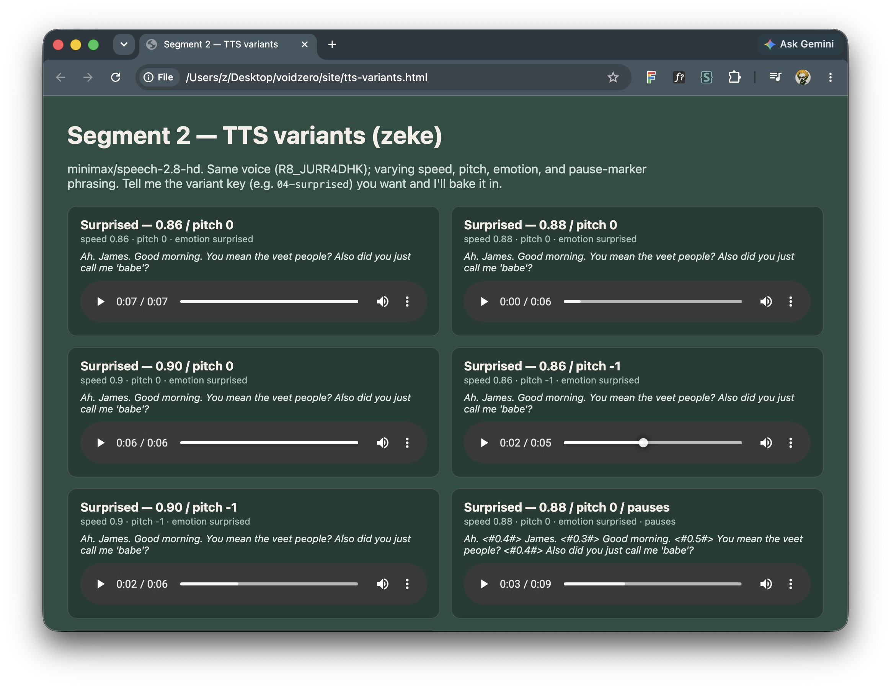
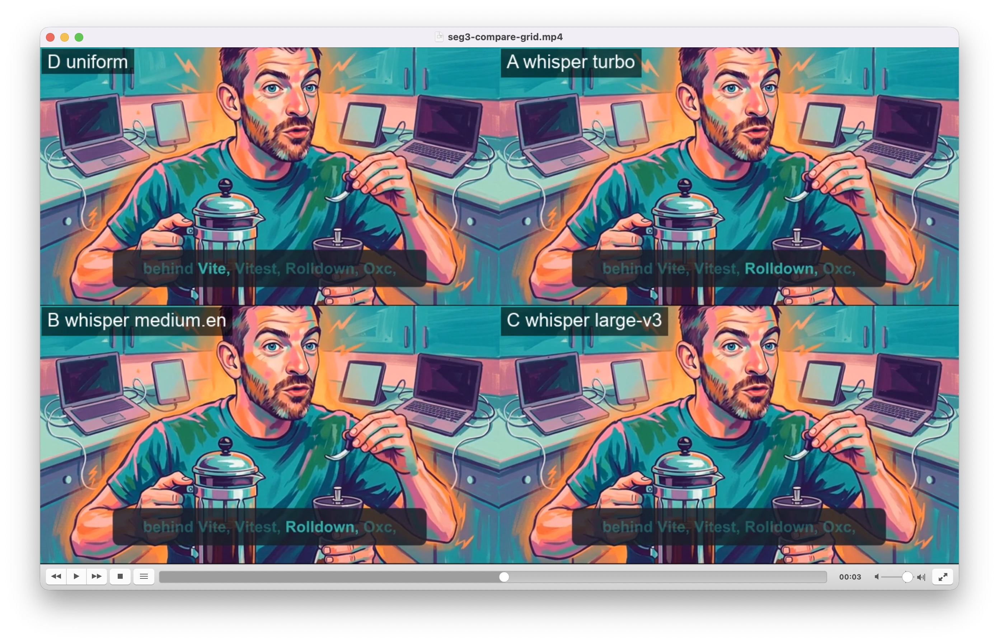
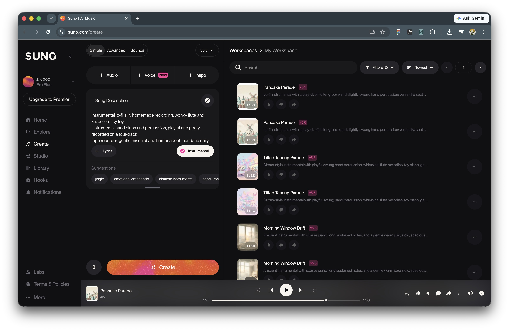
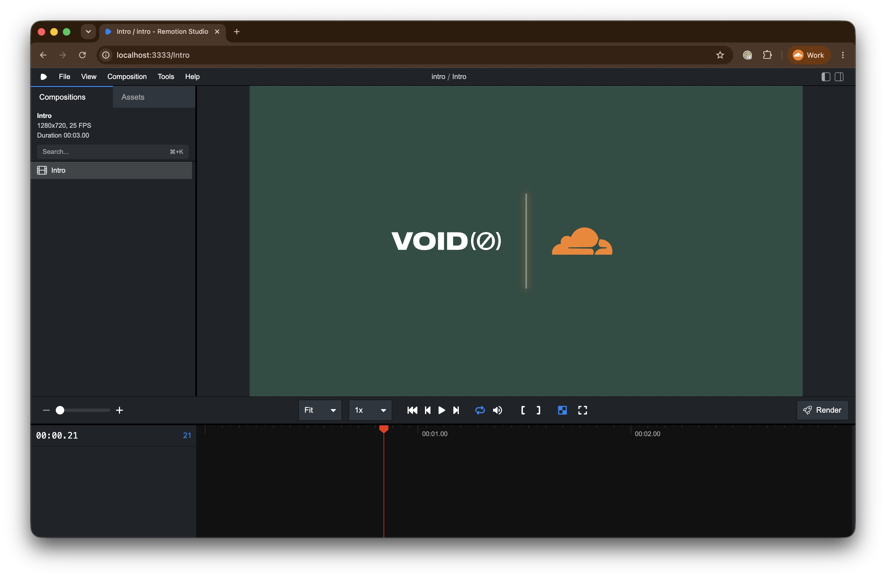
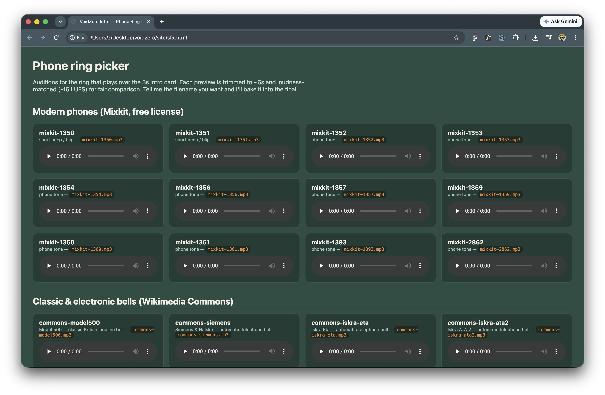
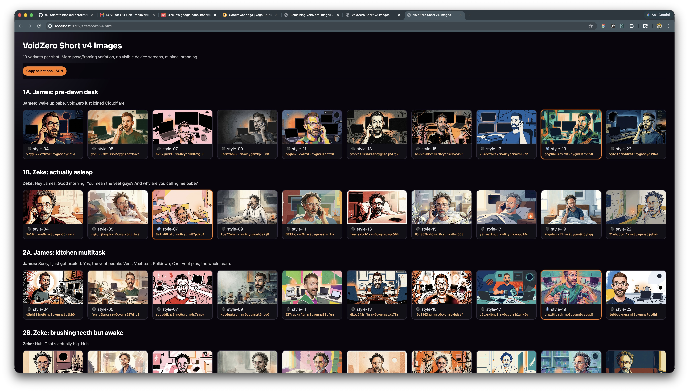

# VoidZero

A short, captioned deepfake video announcing that [VoidZero](https://voidzero.dev/), the team behind [Vite](https://vite.dev/), [Vitest](https://vitest.dev/), [Rolldown](https://rolldown.rs/), [Oxc](https://oxc.rs/), and Vite+, is joining [Cloudflare](https://www.cloudflare.com/).

Instead of a press release, the news is delivered as an early-morning phone call between two deepfaked coworkers: James, who is already wide awake and far too online, and Zeke, who is very much not. James breaks the news, Zeke slowly catches up over coffee, and along the way the important points land: Vite stays open source and vendor-neutral, there is a million-dollar ecosystem fund for maintainers, and Cloudflare is moving toward Vite rather than the other way around.

The whole thing was built in a single AI coding session: writing the script, generating the artwork, cloning voices, lip-syncing talking heads, burning in captions, and stitching it all together.

## How it works

The video is a conversation split into twelve short segments, alternating between the two characters. Each segment goes through the same assembly line:

1. Art. Each line gets a piece of stylized portrait art that places the speaker in a setting relevant to what they are saying, generated with [Nano Banana 2](https://replicate.com/google/nano-banana-2) on [Replicate](https://replicate.com). The look is illustrated and painterly rather than photorealistic, and every scene uses a different art style so the video stays visually fresh. The morning arc is the through-line: Zeke wakes up in bed, shuffles to the bathroom, pours coffee, and ends up in a sunny garden, getting visibly more awake as the news sinks in. James, meanwhile, is plugged in from the first second.

2. Voice. Each character has a cloned voice. The script is fed to [MiniMax Speech](https://replicate.com/minimax/speech-2.8-hd) so every line is spoken in the right voice, with small tweaks for delivery, like slowing Zeke down so he actually sounds half-asleep at the start.

   

3. Lip-sync. Each portrait is turned into a talking head with [VEED Fabric 1.0](https://replicate.com/veed/fabric-1.0), animated to match the generated speech, so the characters appear to say their lines.

4. Captions. Word-by-word captions are burned into each clip with [nice-ass-captions](https://github.com/zeke/nice-ass-captions), color-matched to the art of that scene, with product names like Vite and Rolldown spelled correctly. Word timing comes from [whisper.cpp](https://github.com/ggml-org/whisper.cpp), but the displayed words are driven by the exact script rather than guessed from the audio, so they always match what is said.

   

5. Stitch. All twelve captioned clips are joined into the final video with [ffmpeg](https://ffmpeg.org).

6. Background Music. The final video is layered with instrumental background music generated with Suno AI. The music sets a playful, goofy tone that complements the casual phone conversation between friends. Rather than orchestral or polished production, the track uses lo-fi homemade aesthetics: wonky flute and kazoo, creaky toy instruments, hand percussion—the kind of thing that sounds like it was recorded on a four-track tape recorder in someone's bedroom. The music gently pokes fun at the mundanity of daily morning routines while staying supportive of the dialogue.

The successful Suno prompt was:

> Instrumental lo-fi, silly homemade recording, wonky flute and kazoo, creaky toy instruments, hand claps and percussion, playful and goofy, recorded on a four-track tape recorder, gentle mischief and humor about mundane daily life, morning routine chaos, imperfect and charming, 90 seconds

## Intro, outro, and sound design

The video is wrapped with a short animated logo card built in [Remotion](https://www.remotion.dev/): the VoidZero and Cloudflare logos emerge from a slit in the center of the screen and slide apart, with a faint arrow appearing between them. The same card is played in reverse to make the outro, so the video loops cleanly when it autoplays on social media.

Because the whole story is a phone call, a ringback tone plays over the intro, the sound of waiting for someone to pick up, and then the conversation begins. The background music fades in slowly and ducks under the dialogue so the lines always stay clear.

## The generate-many, pick-the-best workflow

Almost nothing here was a one-shot. For every scene, many candidate images were generated across a wide spread of art styles, then reviewed in a simple local gallery and narrowed down to a favorite. Lines were rewritten, audio was re-recorded when the delivery felt off, and individual segments were regenerated in isolation without rebuilding the whole video. The repo keeps the full set of candidates, not just the winners, so the journey is visible.

## Tools and models

- [Replicate](https://replicate.com) for running all the AI models
- [Nano Banana 2](https://replicate.com/google/nano-banana-2) for image generation
- [MiniMax Speech](https://replicate.com/minimax/speech-2.8-hd) for voice cloning and text-to-speech
- [VEED Fabric 1.0](https://replicate.com/veed/fabric-1.0) for image-to-talking-video lip-sync
- [whisper.cpp](https://github.com/ggml-org/whisper.cpp) for caption word timing
- [nice-ass-captions](https://github.com/zeke/nice-ass-captions) for burning in the stylized captions
- [ffmpeg](https://ffmpeg.org) for normalizing and stitching everything together
- [Suno AI](https://suno.ai) for background music generation
- [OpenCode](https://opencode.ai) as the agent environment where it was all orchestrated

## What it cost

This was produced in one OpenCode session. Two kinds of spend: the AI coding agent that did the work, and the Replicate models that generated the media. The large image count reflects the generate-many-pick-the-best approach: 446 images were generated to choose 12 final scenes.

| Item                        | Count | Est. unit   | Est. cost |
| --------------------------- | ----- | ----------- | --------- |
| OpenCode session (GPT-5.5)  | 1     | —           | ~$92      |
| Nano Banana 2 images        | 446   | ~$0.03–0.04 | ~$13–18   |
| VEED Fabric 1.0 clips       | 30    | ~$0.10–0.20 | ~$3–6     |
| MiniMax TTS + 1 voice clone | 32    | ~$0.01      | ~$0.30    |
| Total                       |       |             | ~$110–115 |

Most of the cost was the agent session, not the media. These figures are estimates: the per-image and per-clip prices are approximate, and the agent cost is the reported session total.

For the technical details of how to run and reproduce everything, see [AGENTS.md](./AGENTS.md).
